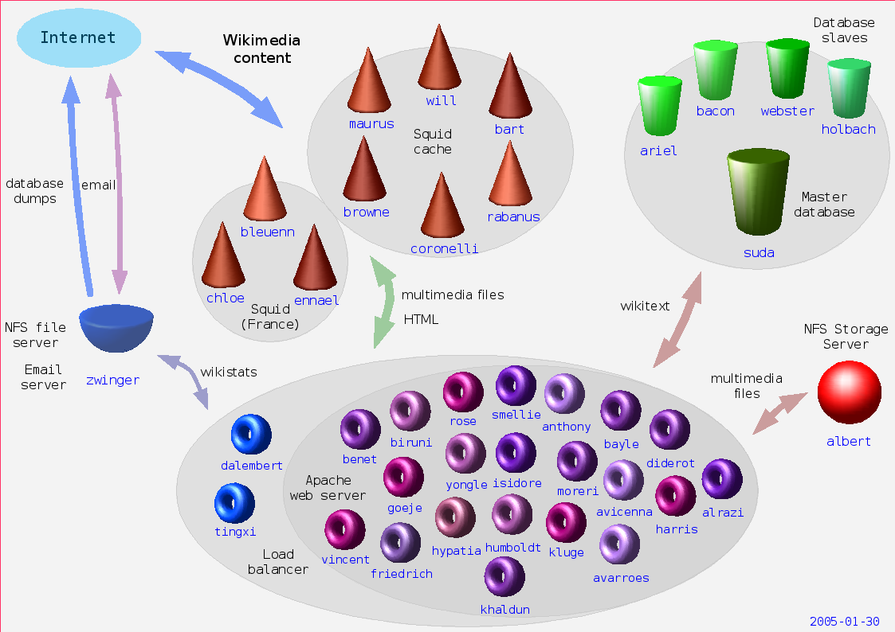
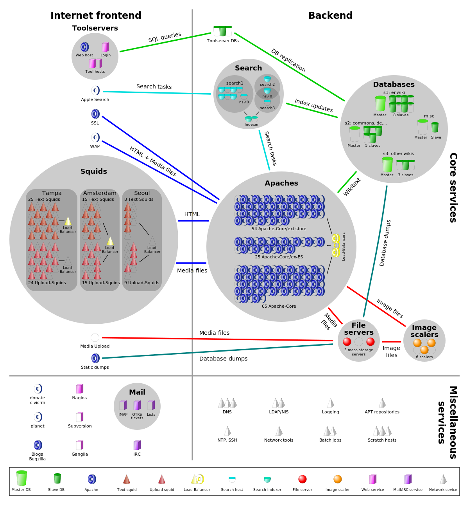
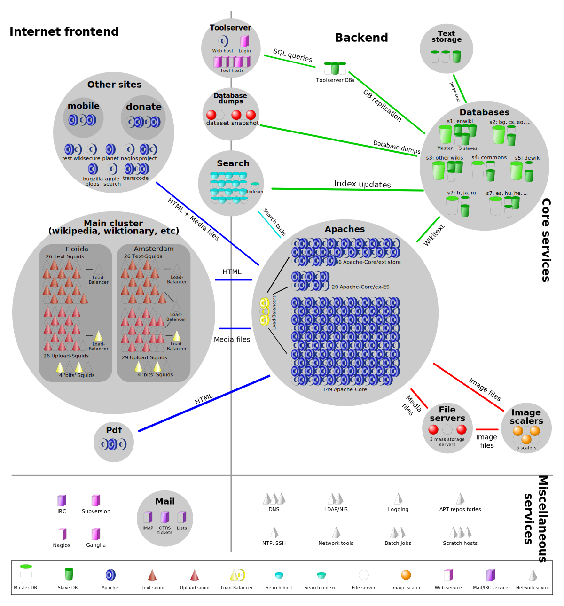
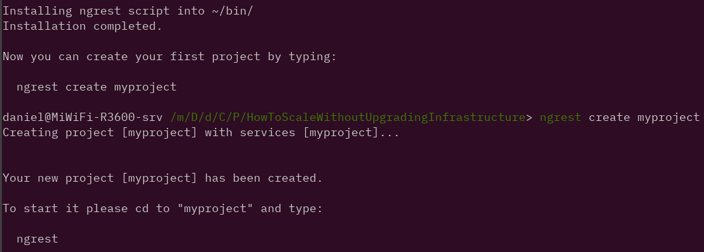
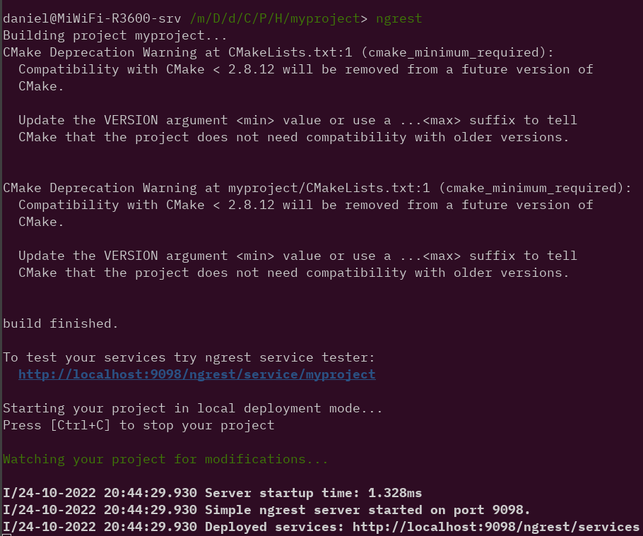
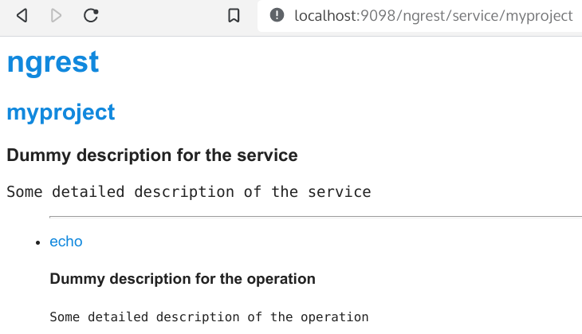
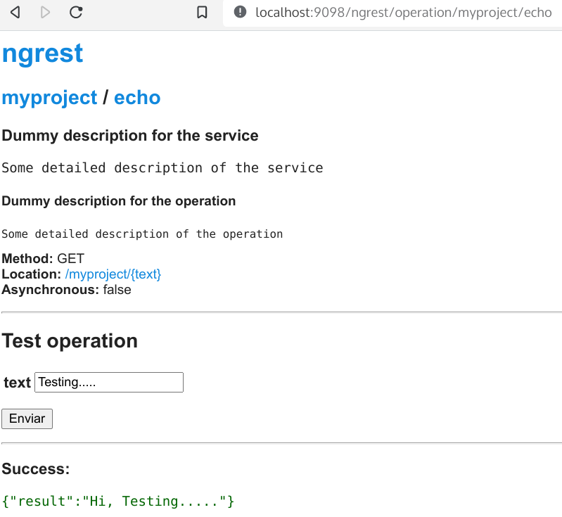
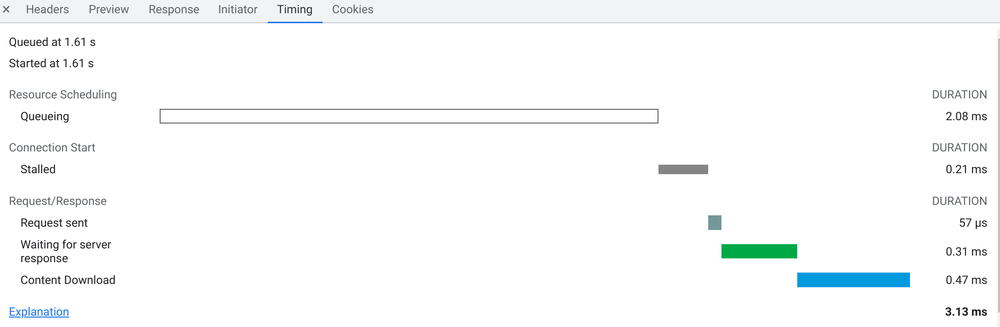

:title: Mejorar el rendimiento de nuestro sitio web
:author: Daniel Saguez Tezanos Pinto
:description: Porque usar servicios REST con C++
:keywords: presentación, restructuredtext, impress.js, REST, C++
:data-transition-duration: 1500
:auto-console: true
:skip-help: false
:css: css/presenta.css

.. header::
   .. image:: Imágenes/scesi.svg
            :width: 8%
            :align: left
   .. image:: Imágenes/logo_flisol_2023.png
            :width: 10%
            :align: right

.. title: Mejorar el rendimiento de nuestro sitio web

----

:id: titulo

###########################################
Mejorar el rendimiento de nuestro sitio web
###########################################

:id: titulo

----

----

:id: contexto

Contexto
^^^^^^^^

:id: contexto

----

:id: introducción

Tenemos datos que publicar
##########################

hay más de 1.000 usuarios
^^^^^^^^^^^^^^^^^^^^^^^^^

:id: introducción

----

- UMSS, UMSA, ..., etc
- INE
- OEP
- Los Tiempos, La Razón, ..., etc
- Viva, Tigo, Entel

----

:id: primero

Identificar el Problema
#######################

- *Procesador*
- *Memoria*
- *Lenguaje* (**C++**, Java, PHP, Python, Node.js)
- *Arquitectura*
- *Base de Datos* (MariaDB, PostgreSQL)
- *Servidor HTTP* (Apache, Nginx, Cherokee)
- *Políticas de Seguridad*

----

:id: clave

- *Ancho de Banda*
- **Latencia**

----

:id: soluciones

Soluciones
^^^^^^^^^^

- veamos que hizo Facebook

----

:id: hiphop
:data-x: r1250
:data-z: r-1000
:data-rotate: 90

Hip·Hop
########

- `HipHop for PHP <https://en.wikipedia.org/wiki/HipHop_for_PHP>`_
  (HPHPc) es un `Transpilador <https://es.wikipedia.org/wiki/Transpilador>`_ de PHP a C++. (descontinuado)

----

:id: hhvm

HHVM
####

`Máquina Virtual HipHop HHVM <https://en.wikipedia.org/wiki/HipHop_Virtual_Machine>`_
es una máquina virtual de código abierto basada en la compilación just-in-time
(JIT) que sirve como motor de ejecución para el lenguaje de programación Hack.

Mediante el uso del principio de compilación JIT, el código Hack se transforma
primero en código intermedio de HipHop (HHBC), que luego se traduce dinámicamente
a código de máquina x86-64.

----

:id: hack

`Hack (programming language) <https://en.wikipedia.org/wiki/Hack_(programming_language)>`_
##########################################################################################

Es un lenguaje de programación para la maquina virtual HipHop, y es un dialecto de PHP.

----

¡ Pero no se como es la infraestructura de Facebook !
#####################################################

:id: no-facebook

----

:id: hhvm_performance
:data-x: r1250
:data-z: r+1000
:data-rotate: 0

HHVM en Wikipedia
#################

**2014-10-08** HHVM es lo mejor desde el pan de molde

.. image:: Imágenes/HHVM_page_editing_time.png
   :width: 60%

.. image:: Imágenes/HHVM_backend_latency_graph.png
   :width: 60%

`Wikipedia_Signpost <https://en.wikipedia.org/wiki/Wikipedia:Wikipedia_Signpost/Single/2014-10-08#HHVM_is_the_greatest_thing_since_sliced_bread>`_

----

:id: wikipedia
:data-x: r+3600
:data-y: r+3600
:data-z: r+500
:data-rotate: 180

Wikipedia
#########

- Hasta el 2004 solo usaban un servidor
- Actualmente recibe entre **25,000 y 60,000** peticiones por segundo.

----

:id: ApacheBackendRequestRate2022
:data-x: r1250
:data-z: r+1250
:data-rotate: r45

.. image:: Imágenes/ApacheBackendRequestRate2022-10-20_12-50.png
   :width: 100%

`Apache backend request rate, by traffic cluster <https://grafana.wikimedia.org/d/000000580/apache-backend-timing?orgId=1&from=1666111702824&to=1666284502824&viewPanel=2>`_

----

:id: wikipedia-servers-2004

.. image:: Imágenes/Wikimedia-servers-2004-08-24.png
   :width: 100%

----

:id: wikipedia-servers-2005

----

:id: wikipedia-servers-2006

.. image:: Imágenes/Wikimedia-servers-2006-05-09.svg
   :width: 100%

----

:id: wikipedia-servers-2008

----

:id: wikipedia-servers-2010

----

:id: wikipedia-servers-2012

.. image:: Imágenes/Wikimedia_Servers.svg
   :width: 100%

----

:data-rotate: r+90

Principio de Pareto
###################

«el 80% del esfuerzo de desarrollo (en tiempo y recursos) produce el 20% del
código, mientras que el 80% restante es producido con tan solo un 20% del
esfuerzo».

----

- `Donald Knuth <https://en.wikipedia.org/wiki/Donald_Knuth>`_:
  "Structured Programming With GoTo Statements",
  Computing Surveys, Vol. 6, No. 4, **December 1974**

"debemos de olvidar las pequeñas eficiencias, digamos alrededor del 97% del tiempo"

.. note:: «En el artículo de Donald Knuth "Structured Programming With GoTo Statements"
  escribió: "Los programadores pierden enormes cantidades de tiempo pensando o
  preocupándose por la velocidad de las partes no críticas de sus programas, y
  estos intentos de eficiencia realmente tienen un fuerte impacto negativo cuando
  a la depuración y el mantenimiento; **debemos de olvidar las pequeñas eficiencias,
  digamos alrededor del 97% del tiempo:** la optimización prematura es la raíz de
  todo mal. Sin embargo, no debemos dejar pasar nuestras oportunidades en ese
  **crítico 3%**".»

----

- **premature optimization is the root of all evil**
  (optimizar de manera prematura es la raíz de todos los males)

----

+ Sin embargo, no debemos dejar pasar nuestras oportunidades en ese
  **crítico 3%**.

----

+ Un buen programador no se dejará llevar por la complacencia de su razonamiento,
  será prudente al mirar cuidadosamente el código crítico;
  **y solo después de que se haya identificado(midiendo) ese código**.

----

+ Un error común es hacer juicios a priori sobre qué partes de un programa son
  realmente críticas, ya que la experiencia universal de los programadores que han
  estado **usando herramientas de medición** ha sido que sus conjeturas intuitivas
  fallan. -« **Diciembre 1974** `DK <https://en.wikipedia.org/wiki/Donald_Knuth>`_»-

----

Representational State Transfer
###############################

`Restful <https://en.wikipedia.org/wiki/Representational_state_transfer>`_
Representational state transfer (REST) es la arquitectura de software que utiliza una interfaz uniforme entre componentes físicamente separados, a menudo a través de Internet sobre una arquitectura Cliente-Servidor

----

Introducción
############

- Algoritmo Divide y vencerás (divide et impera, Aulus Gabinius  {169–170 BC} )
- Heurística con Software Libre

----

Algoritmo Divide y vencerás
############################

En las `CC <https://es.wikipedia.org/wiki/Ciencias_de_la_computaci%C3%B3n>`_, el término divide y vencerás hace
referencia a uno de los más importantes paradigmas de diseño algorítmico.

La idea central es de manera recursiva un problema dividirlo en
dos o más subproblemas de igual tipo o similar. Hasta que
se llega a un resultado simple.

Al final, las soluciones a cada uno de los subproblemas se
combinan para dar una solución al problema original.

.. note:: En política y psicología,
   divide y vencerás o dividir para reinar (del griego: διαίρει καὶ βασίλευε,
   diaírei kaì basíleue) es ganar y mantener el poder mediante la ruptura en piezas
   de las concentraciones más grandes, que tienen individualmente menos energía. El
   concepto se refiere a una estrategia que rompe las estructuras de poder existentes
   y evita la vinculación de los grupos de poder más pequeños. Podría ser utilizada
   en todos los ámbitos en los que, para obtener un resultado favorable, es en primer
   lugar necesario o ventajoso romper o dividir lo que se opone a la solución o a un
   determinado problema inicial.

----

Heurística en Software Libre I
##############################

El problema no solo es mio, entonces ya debe haber alguien con una solución

- Buscar Solución en Software Libre(GitHub, GitLab, Source Forge, etc.)
- Escoger una
- Probar si cumple con mis: Requerimientos y/o Necesidades.
- Si no cumple, entonces: probar otra

----

Heurística en Software Libre II
###############################

- Probé muchas y ninguna me convence
- Escoger la más cercana y adaptarla
- Crear un proyecto Nuevo **(Evitar)**

----

:data-y: r+1000
:data-x: r-5600
:data-z: r-1000

C++ vs Python vs JavaScript vs Java
###################################

Comparación

----

C++
###

+ Velocidad en tiempo de ejecución (Performance)

- **Complejo**
- Tiempo de programación (¡¡¡Donde esta el Dinero!!!)

----

Python
######

+ Simple (Tiempo de Programación)

- Tiempo de Ejecución (performance)

----

Java
####

+ Performance, Mejor de Python inferior a C++

- *Menos complejo que C++ pero más que Python*

----

JavaScript
##########

+ corutinas (paralelo)

- No fue diseñado para uso general(Navegador)

----

`fannkuch-redux <https://benchmarksgame-team.pages.debian.net/benchmarksgame/performance/fannkuchredux.html>`_
##############################################################################################################

=== ================== ========== ======= =========
×   source             secs       mem     cpu
=== ================== ========== ======= =========
1.0 Rust #4                7.21    10,932   28.34
1.0 C gcc #5               7.53    11,224   29.37
1.1 Rust #5                7.77    10,932   30.49
1.1 C++ g++ #5             7.99    10,936   31.23
1.1 Chapel #2              8.09    10,932   32.18
1.1 Ada 2012 GNAT #3       8.23    10,936   32.72
1.1 Go #3                  8.25    10,936   32.92
1.2 F# .NET #6             8.33   106,496   32.25
1.2 OCaml #3               8.76    11,132   34.99
1.2 OCaml #4               8.77    11,128   35.06
1.3 C# .NET #6             9.16    30,572   36.34
=== ================== ========== ======= =========

----

=== ================== ========== ======= =========
×   source             secs       mem     cpu
=== ================== ========== ======= =========
1.3 C++ g++ #2            9.51     10,912   37.33
1.4 F# .NET #5            9.75    111,368   38.19
1.4 C++ g++ #4            9.82     10,912   38.52
1.4 Lisp SBCL #4          9.96     29,748   39.01
1.4 Classic Fortran #3    10.26    11,160   40.95
1.4 C++ g++               10.39    10,912   40.77
1.5 Free Pascal           10.54    11,220   42.09
1.5 Java                  10.71    40,324   42.25
1.5 Node js #5            11.08    81,124   43.87
1.6 Go                    11.83    11,128   47.26
 40 Python 3 #4          285.20    14,264   18 min
=== ================== ========== ======= =========

----

:id: cpp
:data-y: 4600
:data-z: 7600
:data-rotate: 90

+------------------------+----------------------------------------------------+
|                        | `C++ <https://en.wikipedia.org/wiki/C++>`_         |
+========================+====================================================+
|logo                    | .. image:: Imágenes/ISO_C++_Logo.svg               |
|                        |    :height:  80em                                  |
+------------------------+----------------------------------------------------+
|extensiones             | ``.h .hh .hpp .hxx .h++ .cc .cpp .cxx .c++``       |
+------------------------+----------------------------------------------------+
|Paradigmas              | **procedural, imperativo, funcional,               |
|                        | orientado a objeto, genérico, modular**.           |
+------------------------+----------------------------------------------------+
|Apareció por primera vez| 1985 ( hace 38 años )                              |
+------------------------+----------------------------------------------------+
|Diseñado por            | **Bjarne Stroustrup**, Bell Labs                   |
+------------------------+----------------------------------------------------+
|Stable release          | C++20 (ISO/IEC 14882:2020)                         |
+------------------------+----------------------------------------------------+
|Release date            | 15 de diciembre del 2020; hace 2 años              |
+------------------------+----------------------------------------------------+
|Preview release         | C++23                                              |
+------------------------+----------------------------------------------------+
|Disciplina de tipos     | Estático, fuerte, nominativo, parcialmente inferido|
+------------------------+----------------------------------------------------+

----

+--------------------+-------------------------------------------------+
|                    | `C++ <https://en.wikipedia.org/wiki/C++>`_      |
+====================+=================================================+
|Implementaciones    | GCC, LLVM Clang, Microsoft Visual C++,          |
|                    | Intel C++ Compiler, IBM XL C++, EDG             |
+--------------------+-------------------------------------------------+
|Influenciado por    | Ada, ALGOL 68, BCPL, C, CLU, ML, Mesa,          |
|                    | Modula-2,[1] Simula, Smalltalk                  |
+--------------------+-------------------------------------------------+
|Influyo             | Ada 95, C#, C99, Chapel, Clojure, D, Java, JS++,|
|                    | Lua, Nim, Objective-C++, Perl, PHP, Python,     |
|                    | **Rust**, Seed7, **Carbon**                     |
+--------------------+-------------------------------------------------+
|Sistemas Operativos | Multi plataforma                                |
+--------------------+-------------------------------------------------+

----

:id: ngrest

NGREST
######

`ngrest <https://github.com/loentar/ngrest>`_ es un framework REST en C++. Es pequeño,
rápido y **muy fácil de usar**.

----

.. image:: Imágenes/InstallNGRest.png
   :width: 110%

----

----

----

----

.. image:: Imágenes/EchoTest.png
   :width: 90%

----

----

----

.. code:: c++

  #include <ngrest/common/Service.h>

  class myproject: public ngrest::Service
  {
  public:
    std::string echo(const std::string& text);
  };

----

.. code:: c++

   #include "myproject.h"

   std::string myproject::echo(const std::string& text)
   {
       return "Hi, " + text;
   }

----

.. code:: c++

    // *method: POST
    // *location: echo
    std::string echoPost(const std::string& text);

    //! a simple operation "echo"
    /*!
      example of GET request:
      http://server:port/ngrest/examples/Echo?text=Hello%20World!
    */
    // *method: GET
    // *location: echo?text={text}
    std::string echoGet(const std::string& text);
 };

 }}

----

`Ngrest-db <https://github.com/loentar/ngrest-db>`_
###################################################

Es un ORM pequeño y fácil de usar, para trabajar junto con ngrest.

- Mapea la estructura proporcionada por el desarrollador de las tablas
  de base de datos.
- Sintaxis fácil e intuitiva para realizar las operaciones db más utilizadas.

----

- Generador de código para máxima comodidad y velocidad de desarrollo
- Utiliza meta-comentarios para proporcionar funcionalidad adicional específica de la base de datos (PK, FK, UNIQUE, etc.) (**Como las anotaciones en Hibernate**)
- Fácil de integrar con los servicios ngrest

----

**Ventajas**:

- meta-comentarios para proporcionar funcionalidad adicional y específica
  de la base de datos (PK, FK, ÚNICO, etc.)
- fácil de integrar con los servicios de ngrest

----

DBMS soportados:

- SQLite3
- MySQL
- PostgreSQL

----

:data-x: r-950
:data-y: r+950
:data-z: r+1300

.. code:: c++

 #include <ngrest/common/Nullable.h>

 // *table: users
 struct User
 {
    // *pk: true
    // *autoincrement: true
    int id;

    std::string name;

    // *unique: true
    // *type: varchar(64)
    std::string email;

    // *type: timestamp
    // *default: CURRENT_TIMESTAMP
    // *ignoreOnInsert: true
    std::string registered;
 };

----

:id: fin

Fin
#######

¡¡¡ Gracias !!!
^^^^^^^^^^^^^^^

:id: fin

----

:data-x: r+3600
:data-z: r-2600
:data-y: r+1750
:data-rotate: 0

Fravia+
#######

.. image:: Imágenes/Fravia.jpg
   :width: 45%

Francesco Vianello (30 de agosto de 1952 - 3 de mayo de 2009), más conocido por
su apodo Fravia+, fue un ingeniero inverso de software y «seeker» conocido por
su archivo web de las técnicas y trabajos sobre **ingeniería inversa**.

----

Edward Snowden
##############

.. image:: Imágenes/Edward_Snowden.jpg
   :width: 40%

Edward Joseph Snowden (Elizabeth City, 21 de junio de 1983) es un consultor
tecnológico estadounidense, informante, antiguo empleado de la CIA (Agencia
Central de Inteligencia) y de la NSA (Agencia de Seguridad Nacional).

En junio del 2013, Snowden hizo públicos, a través de los periódicos The
Guardian y The Washington Post, documentos clasificados como alto secreto
sobre varios programas de la NSA, incluyendo los programas de vigilancia
masiva PRISM y XKeyscore

----

:data-x: r9400
:data-y: r+1200
:data-z: r+6400

Aaron Swartz
############

.. image:: Imágenes/Aaron_Swartz_profile.jpg
   :width: 25%

Aaron Hillel Swartz (8 de noviembre de 1986, Chicago - 11 de enero de 2013, Nueva
York) fue un programador, emprendedor, escritor, activista político y hacktivista
de Internet. Estuvo involucrado en el desarrollo del formato de fuente web RSS, y
el formato de publicación Markdown, la organización Creative Commons, la
infraestructura del sitio web "web.py" y el sitio web de marcadores sociales
Reddit, del cual se convirtió en socio luego de que éste se fusionara con su
compañía, Infogami. Recibió atención de los medios después de la **recolección de
artículos de revistas académicas JSTOR.**

Fue diseñador jefe del proyecto inicial de Open Library.

----

Alexandra Elbakyan
##################

.. image:: Imágenes/Alexandra_Elbakyan_(cropped).jpg
   :width: 50%

Alexandra Asanovna Elbakyan (1988) es una desarrolladora de software y
neurocientífica de Kazajistán, más conocida por ser la fundadora del proyecto
**Sci-Hub** en 2011 una web de acceso libre a más de 40 millones de artículos
científicos recientes.

----

:data-x: r-950
:data-y: r+950
:data-z: r+1300

Donald Knuth
############

.. image:: Imágenes/Donald_Ervin_Knuth_(cropped).jpg
   :width: 45%

Donald Ervin Knuth (Milwaukee, Wisconsin; 10 de enero 1938) es un reconocido experto en ciencias de la computación estadounidense y matemático, famoso por su fructífera investigación dentro del análisis de algoritmos y compiladores.

----

:data-y: 11600
:data-x: 0
:data-z: 11600

Pablo Azero
###########

.. image:: Imágenes/pabloAzero.jpg
    :width: 45%

30 años en docencia universitaria de pregrado y posgrado en informática e ingeniería de software y 20 años en la industria del software.

"Improving type-error messages in functional languages"
Bastiaan Heeren, Johan Jeuring, Doaitse Swierstra,
Pablo Azero Alcocer

----

¡¡¡ Gracias !!!
^^^^^^^^^^^^^^^
