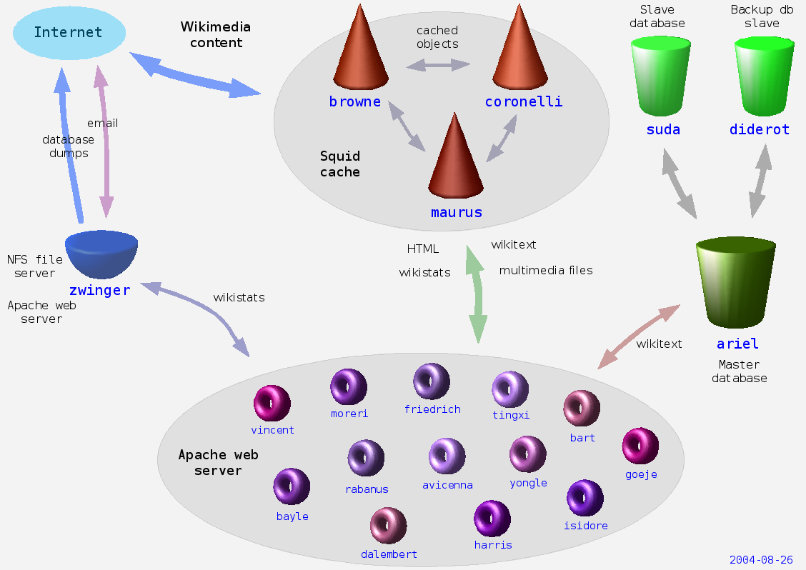
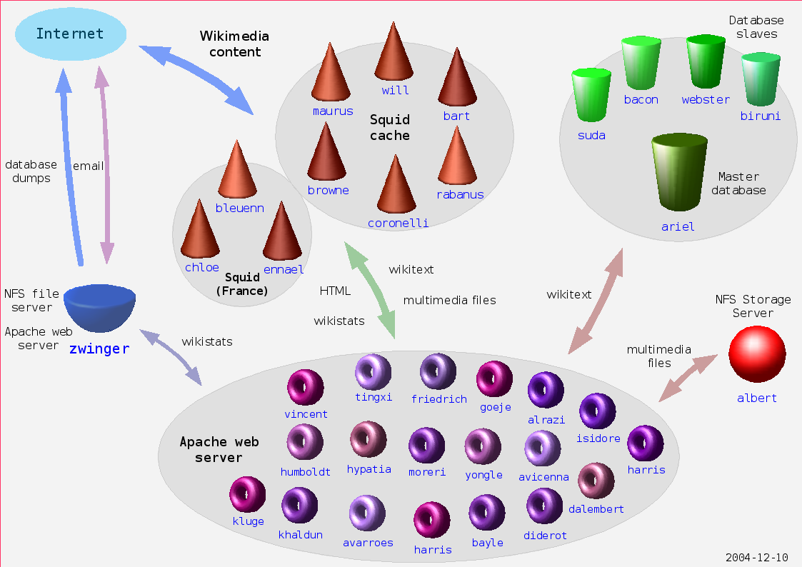
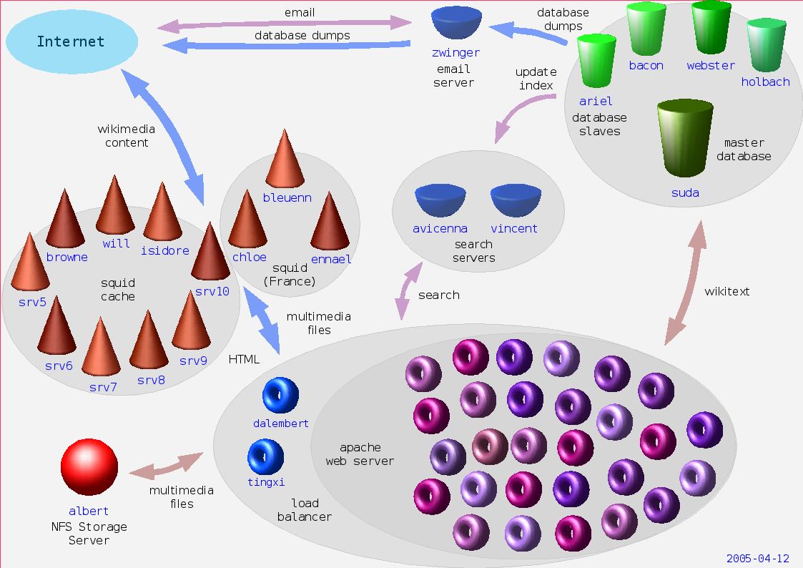
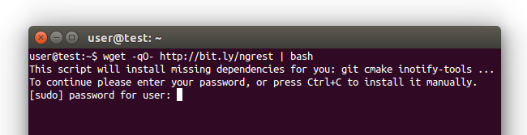
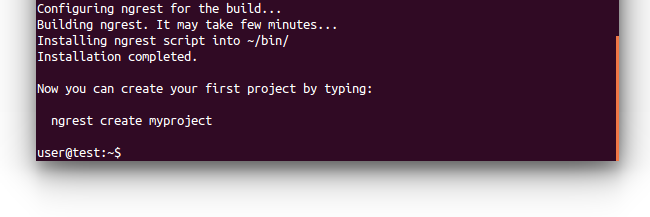
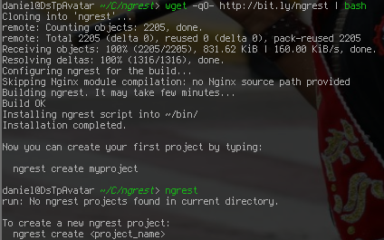
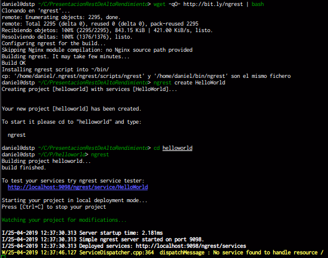

:title: Servicios Rest de Alto Rendimiento con C++
:author: Daniel Saguez Tezanos Pinto
:description: Porque usar servicios REST con C++
:keywords: presentación, restructuredtext, impress.js, REST, C++
:data-transition-duration: 1500
:auto-console: true
:skip-help: true
:css: css/presenta.css

.. title: Servicios Rest de Alto Rendimiento con C++

----

##########################################
Servicios Rest de Alto Rendimiento con C++
##########################################

----

Contexto
^^^^^^^^

----

Tenemos datos que publicar
##########################

hay más de 1.000 usuarios
^^^^^^^^^^^^^^^^^^^^^^^^^
:id: introducción

- UMSS, UMSA, ..., etc
- INE
- OEP
- Los Tiempos, La Razón, ..., etc
- Viva, Tigo, Entel

----

Identificar el Problema
#######################

- *Procesador*
- *Memoria*
- *Lenguaje* (**C++**, Java, PHP, Python, Node.js)
- *Arquitectura*
- *Base de Datos* (MariaDB, PostgreSQL)
- *Servidor HTTP* (Apache, nginx, Cherokee)
- *Politicas de Seguridad*

----

- **Ancho de Banda**

----

Soluciones
^^^^^^^^^^

----

:data-x: r1250
:data-z: r-1000
:data-rotate: 90

HipHop
########

- `HipHop for PHP <https://en.wikipedia.org/wiki/HipHop_for_PHP>`_
  (HPHPc) es un transcompilador PHP. (descontinuado)

----

HHVM
####

- `Máquina Virtual HipHop HHVM <https://en.wikipedia.org/wiki/HipHop_Virtual_Machine>`_
  es una máquina virtual de código abierto basado en compilador Just-in-Time
  (JIT), el cual sirve como un motor de ejecución para los lenguajes PHP y Hack.

----

¡ Pero no se como es la infraestructura de Facebook !
#####################################################

----

:data-x: r+3600
:data-y: r+3600
:data-rotate: 180

Wikipedia
#########

- Hasta el 2004 solo usaban un servidor
- Actualmente recibe entre **25.000 y 60.000** consultas por segundo

----

:data-x: r1250
:data-z: r-1000

.. image:: Imágenes/Wikimedia-servers-2004-02-19-800wide.png
   :width: 100%

----

.. image:: Imágenes/Wikimedia-servers-2004-08-24.png
   :width: 100%

----

----

.. image:: Imágenes/Wikimedia-servers-2004-11-11.png
   :width: 100%

----

----

.. image:: Imágenes/Wikimedia-servers-2005-01-30.png
   :width: 100%

----

----

.. image:: Imágenes/Wikimedia-servers-2006-05-09.svg
   :width: 100%

----

.. image:: Imágenes/Wikimedia-servers-2008-11-10.svg
   :height: 730px

----

.. image:: Imágenes/Wikimedia-servers-2010-12-28.svg
   :height: 730px

----

.. image:: Imágenes/Wikimedia_Servers.svg
   :width: 100%

----

:data-y: 4600
:data-z: 4600
:data-rotate: 90

+--------------------------+----------------------------------------------------+
|                          | `C++ <https://es.wikipedia.org/wiki/C++>`_         |
+==========================+====================================================+
|logo                      | .. image:: Imágenes/C_plus_plus.svg                |
+--------------------------+----------------------------------------------------+
|extensiones comunes       | ``.h .hh .hpp .hxx .h++ .cc .cpp .cxx .c++``       |
+--------------------------+----------------------------------------------------+
|paradigma                 | **multiparadigma, orientado a objetos,             |
|                          | programación genérica, procedural**.               |
+--------------------------+----------------------------------------------------+
|año                       | 1985 ( 34 años )                                   |
+--------------------------+----------------------------------------------------+
|diseñador                 | **Bjarne Stroustrup**, Bell Labs                   |
|desarrollador             |                                                    |
+--------------------------+----------------------------------------------------+
|última versión            | ISO/IEC 14882:2017                                 |
+--------------------------+----------------------------------------------------+
|fecha última versión      | 1 de Diciembre del 2017                            |
+--------------------------+----------------------------------------------------+
|última versión Desarrollo | Se trabaja en el C++20                             |
+--------------------------+----------------------------------------------------+
|tipo dato                 | estático, nominativo, parcialmente inferido        |
+--------------------------+----------------------------------------------------+

----

+-------------------------+----------------------------------------------------+
|                         | `C++ <https://es.wikipedia.org/wiki/C++>`_         |
+=========================+====================================================+
|implementaciones         | C++ Builder, clang, Comeau C/C++, GNU Compiler     |
|                         | Collection/GCC, Intel C++ Compiler, Microsoft      |
|                         | Visual C++, Sun Studio, Code::Blocks, Zinjai       |
+-------------------------+----------------------------------------------------+
|dialectos                | ISO/IEC 14882|ISO/IEC C++ 1998, ISO/IEC            |
|                         | 14882|ISO/IEC C++ 2003, ISO/IEC 14882|ISO/IEC C++  |
|                         | 2011, 2017, 2020                                   |
+-------------------------+----------------------------------------------------+
|influido por             | C, Simula, Ada 83, ALGOL 68, CLU, ML               |
+-------------------------+----------------------------------------------------+
|ha influido              | Perl 1987, LPC 1989, Lua 1993, Pike 1994, Ada 95,  |
|                         | Java 1995, PHP 1995, D 1999, C99, C# 2001, Falcon  |
|                         | 2003, **Rust**                                     |
+-------------------------+----------------------------------------------------+
|sistema operativo        | Multiplataforma                                    |
+-------------------------+----------------------------------------------------+

----

:data-y: r+4600
:data-x: r-5600
:data-z: r-1000

C++ vs Python vs Node.js vs Java
################################

----

C++
###

+ Veloz

- **Complicado**

----

Python
######

+ No tan veloz
+ Simple de usar

----

Java
####

+ No tan veloz, mucho más rapido que python

- *no tan complicado como C++*

----

Node.js
#######

+ Paralelo por naturaleza

- JavaScript

----

:data-rotate: r+90

Principio de Pareto
###################

«el 80 % del esfuerzo de desarrollo (en tiempo y recursos) produce el 20 % del
código, mientras que el 80 % restante es producido con tan solo un 20 % del
esfuerzo».

----

«En el artículo de Donald Knuth "Structured Programming With GoTo Statements"
escribió: "Los programadores pierden enormes cantidades de tiempo pensando o
preocupándose por la velocidad de las partes no críticas de sus programas, y
estos intentos de eficiencia realmente tienen un fuerte impacto negativo cuando
a la depuración y el mantenimiento; **deben olvidarse de las pequeñas eficiencias,
digamos alrededor del 97% del tiempo:** la optimización prematura es la raíz de
todo mal. Sin embargo, no debemos dejar pasar nuestras oportunidades en ese
**crítico 3%**".»

----

Representational State Transfer
###############################

`Restful <https://es.wikipedia.org/wiki/Representational_State_Transfer>`_

La Transferencia de Estado Representacional (Representational State Transfer) o
REST es un estilo de arquitectura software para sistemas hipermedia distribuidos
como la World Wide Web. El término se originó en el año 2000, en una tesis
doctoral sobre la web escrita por **Roy Fielding**, uno de los principales
autores de la especificación del protocolo HTTP y ha pasado a ser ampliamente
utilizado por la comunidad de desarrollo.

----

Introducción
############

- Divide y Vencerás (desde el Imperio Romano {228 a.c.} a nuestros días )
- Heurística en Software Libre

----

Divide y Vencerás I
###################

En política y psicología, divide y vencerás o dividir para reinar (del
griego: διαίρει καὶ βασίλευε, diaírei kaì basíleue) es ganar y mantener el
poder mediante la ruptura en piezas de las concentraciones más grandes, que
tienen individualmente menos energía. El concepto se refiere a una estrategia
que rompe las estructuras de poder existentes y evita la vinculación de los
grupos de poder más pequeños. Podría ser utilizada en todos los ámbitos en
los que, para obtener un resultado favorable, es en primer lugar necesario o
ventajoso romper o dividir lo que se opone a la solución o a un determinado
problema inicial.

----

Divide y Vencerás II
####################

En las ciencias de la computación, el término divide y vencerás (DYV) hace
referencia a uno de los más importantes paradigmas de diseño algorítmico. El
método está basado en la resolución recursiva de un problema dividiéndolo en
dos o más subproblemas de igual tipo o similar. El proceso continúa hasta que
éstos llegan a ser lo suficientemente sencillos como para que se resuelvan
directamente. Al final, las soluciones a cada uno de los subproblemas se
combinan para dar una solución al problema original.

----

Heurística en Software Libre I
##############################

El problema no solo es mio, entonces ya debe haber alguien con una solución

- Buscar Solución en Software Libre
- Escoger una
- Probar si cumple con mis: Requerimientos y/o Necesidades.
- Si no cumple, entonces: probar otra

----

Heurística en Software Libre II
###############################

- Probé muchas y ninguna me convence
  - Escoger la mas cercana y adaptarla
  - Crear un proyecto Nuevo

----

NGREST
######

ngrest es un framework REST simple desarrollado en C++. Poca huella de código,
extremadamente rápido y **muy fácil de usar**.

----

.. image:: Imágenes/01.png
   :width: 100%

----

----

----

----

----

.. code:: c++

   #include "Echo.h"

   namespace ngrest {
   namespace examples {

   std::string Echo::echoPost(const std::string& text) {
     return "You said: [" + text + "]";
   }

   std::string Echo::echoGet(const std::string& text) {
    return "You said: [" + text + "]";
   }

   }}

----

.. code:: c++

 #include <string>
 #include <ngrest/common/Service.h>

 namespace ngrest {
 namespace examples {

 //! Echo service example
 /*! by default exposes Echo service relative to base
 URL: http://server:port/ngrest/examples/Echo */
 class Echo: public Service {
  public:
    //! a simple operation "echo"
    /*!
      example of POST request:
      http://server:port/ngrest/examples/Echo/echo
      -- body -----------------------
      {
        "text": "Hello ngrest!"
      }
      -- end body -------------------
    */

----

.. code:: c++

    // *method: POST
    // *location: echo
    std::string echoPost(const std::string& text);

    //! a simple operation "echo"
    /*!
      example of GET request:
      http://server:port/ngrest/examples/Echo?text=Hello%20World!
    */
    // *method: GET
    // *location: echo?text={text}
    std::string echoGet(const std::string& text);
 };

 }}

----

Ngrest-db
#########

Es un ORM pequeño y fácil de usar, para trabajar junto con ngrest.

- Mapea la estructura proporcionada por el desarrollador de las tablas de base de datos.
- Sintaxis fácil e intuitiva para realizar las operaciones db más utilizadas.
- Generador de código para máxima comodidad y velocidad de desarrollo
- Utiliza meta-comentarios para proporcionar funcionalidad adicional específica de la base de datos (PK, FK, UNIQUE, etc.) (**Como las anotaciones en Hibernate**)
- Fácil de integrar con los servicios ngrest

----

DBMS soportados:

- SQLite3
- MySQL
- PostgreSQL

----

:data-y: 11600
:data-x: 0
:data-z: 11600

Julian Assange
##############

.. image:: Imágenes/Julian_Assange_cropped_(Norway,_March_2010).jpg
   :width: 50%

Julian Paul Assange (Townsville, Queensland, 3 de julio de 1971), conocido como
Julian Assange, es un programador, ciberactivista, periodista y activista de
Internet australiano, conocido por ser el fundador, editor y portavoz del sitio
web WikiLeaks.

----

:data-x: r+3600
:data-z: r-2600
:data-y: r+1750
:data-rotate: 0

Fravia+
#######

.. image:: Imágenes/Fravia.jpg
   :width: 50%

Francesco Vianello (30 de agosto de 1952 - 3 de mayo de 2009), más conocido por
su apodo Fravia+, fue un ingeniero inverso de software y «seeker» conocido por
su archivo web de las técnicas y trabajos sobre **ingeniería inversa**.

----

Ian Murdock
###########

.. image:: Imágenes/IanMurdock.jpg
   :width: 50%

Ian Ashley Murdock (Konstanz, Alemania, 28 de abril de 1973-28 de diciembre de
2015) fue un informático alemán y fue el fundador y primer líder del proyecto de
software libre Debian.

En 1993 escribió el Manifiesto Debian mientras estudiaba en la Purdue University,
donde en 1996 obtuvo su licenciatura. La palabra Debian proviene de la
combinación del nombre de su entonces novia Deborah y el suyo, por lo tanto,
Deb(orah) e Ian.

Fue fundador, también, de la empresa Progeny Linux Systems. Fue CTO de la Linux
Foundation y líder del Proyecto Indiana cuando trabajaba para Sun Microsystems.

----

Edward Snowden
##############

.. image:: Imágenes/Edward_Snowden.jpg
   :width: 50%

Edward Joseph Snowden (Elizabeth City, 21 de junio de 1983) es un consultor
tecnológico estadounidense, informante, antiguo empleado de la CIA (Agencia
Central de Inteligencia) y de la NSA (Agencia de Seguridad Nacional).

En junio del 2013, Snowden hizo públicos, a través de los periódicos The
Guardian y The Washington Post, documentos clasificados como alto secreto
sobre varios programas de la NSA, incluyendo los programas de vigilancia
masiva PRISM y XKeyscore

----

Chelsea Manning
###############

.. image:: Imágenes/Bradley_Manning_US_Army.jpg
   :width: 50%

Chelsea Elizabeth Manning (nacida Bradley Edward Manning, Crescent, Oklahoma, 17
de diciembre de 1987) es una exsoldado y analista de inteligencia del ejército
de los Estados Unidos. Manning cobró notoriedad internacional por supuestamente
haber filtrado a WikiLeaks miles de documentos clasificados acerca de las
guerras de Afganistán —conocidos como los Diarios de la Guerra de Afganistán— y
de Irak, incluidos numerosos cables diplomáticos de diversas embajadas
estadounidenses y el video del ejército conocido como Collateral Murder
(«asesinato colateral»).

----

Ola Bini
########

.. image:: Imágenes/Ola_Bini_congreso.jpg
   :width: 50%

Ola Bini, (Gotemburgo, 1982) es un desarrollador de software, programador, y
activista de Internet sueco, trabaja para el Centro de Autonomía Digital en
problemas de privacidad, seguridad y criptografía. Radicado en Ecuador desde
2013. En abril de 2019 fue detenido por estar presuntamente vinculado a Julian
Assange y Wikileaks.

----

:data-x: r+1600
:data-z: r+1600
:data-rotate: 360

George Hotz
###########

.. image:: Imágenes/George_Hotz.jpg
   :width: 50%

Francis George Hotz, (n. 2 de octubre de 1989), alias geohot, es un hacker estadounidense experto en seguridad de sistemas informáticos que cobró notoriedad por la gran precocidad que demostró con 17 años al crear blackra1n que, aprovechando otros desarrollos, lograba ser el primero en desbloquear el iPhone, permitiendo que el dispositivo sea utilizado con otros operadores de telecomunicaciones, a diferencia de la intención de Apple de proveer a sus clientes con sólo el uso de la red de AT&T.1

----

:data-x: r9400
:data-y: r+1200
:data-z: r+6400

Aaron Swartz
############

.. image:: Imágenes/Aaron_Swartz_profile.jpg
   :width: 50%

Aaron Hillel Swartz (8 de noviembre de 1986, Chicago - 11 de enero de 2013, Nueva
York) fue un programador, emprendedor, escritor, activista político y hacktivista
de Internet. Estuvo involucrado en el desarrollo del formato de fuente web RSS, y
el formato de publicación Markdown, la organización Creative Commons, la
infraestructura del sitio web "web.py" y el sitio web de marcadores sociales
Reddit, del cual se convirtió en socio luego de que éste se fusionara con su
compañía, Infogami. Recibió atención de los medios después de la **recolección de
artículos de revistas académicas JSTOR.**

Fue diseñador jefe del proyecto inicial de Open Library.

----

No hay justicia al cumplir leyes injustas. Es hora de salir a la luz y,
siguiendo la tradición de la desobediencia civil, oponernos a este robo
privado de la cultura pública.

    *Aaron Swartz*

----

La información es poder. Pero como todo poder, hay quienes quieren
mantenerlo para sí mismos.

    *Aaron Swartz*

----

Alexandra Elbakyan
##################

.. image:: Imágenes/Alexandra_Elbakyan_(cropped).jpg
   :width: 50%

Alexandra Asanovna Elbakyan (1988) es una desarrolladora de software y
neurocientífica de Kazajistán, más conocida por ser la fundadora del proyecto
**Sci-Hub** en 2011 una web de acceso libre a más de 40 millones de artículos
científicos recientes.

----

:data-x: r-950
:data-y: r+950
:data-z: r+1300

.. code:: c++

 #include <list>
 #include <iostream>

 #include <ngrest/utils/Log.h>

 #ifdef HAS_SQLITE
 #include <ngrest/db/SQLiteDb.h>
 #endif
 #ifdef HAS_MYSQL
 #include <ngrest/db/MySqlDb.h>
 #endif
 #ifdef HAS_POSTGRES
 #include <ngrest/db/PostgresDb.h>
 #endif
 #include <ngrest/db/Table.h>

 #include "datatypes.h"

----

Fin
###

¡¡¡ Gracias !!!
^^^^^^^^^^^^^^^
